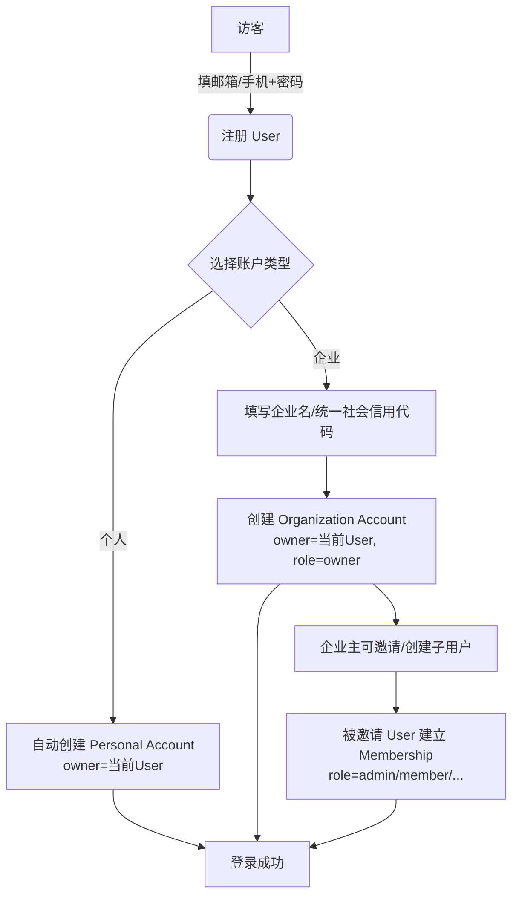
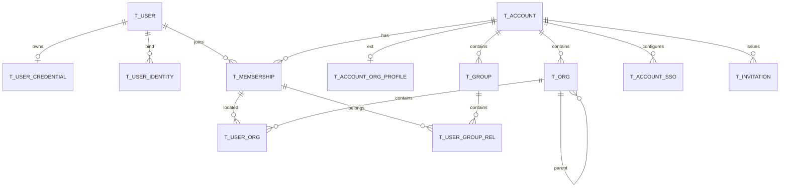

# iam-account 模块设计文档

> 模块路径：`apps/backend/iam-account`
> 版本：v1（平台注册制 · 个人/企业双形态 · 企业可建组织与子用户）
> 最后更新：2026-08-08

## 目录

- [一、核心业务模型](#一核心业务模型)
- [二、功能模块规划](#二功能模块规划)
- [三、数据库设计](#三数据库设计)
- [四、关键设计取舍](#四关键设计取舍)
- [五、典型业务场景](#五典型业务场景)
- [六、开放问题](#六开放问题)

---

## 一、核心业务模型

### 1.1 三个关键概念

| 概念 | 定义 | 举例 |
|---|---|---|
| **User（自然人账号）** | 平台上一个真实的自然人，由邮箱/手机号唯一标识。**所有登录都以 User 身份登录**。 | 张三 zhang@x.com |
| **Account（账户空间）** | 一个"资源归属容器"，分两种类型：**个人账户**（Personal）和**企业账户**（Organization）。业务数据、订阅、计费都挂在 Account 下。 | 张三的个人账户 / 阿里巴巴企业账户 |
| **Membership（成员关系）** | User 与 Account 的 M:N 关联，一个 User 可加入多个 Account，同时在不同 Account 下有不同角色。**"子用户"本质就是一条 Membership**。 | 张三 是 阿里巴巴 的 admin |

### 1.2 注册流程



### 1.3 "子用户"的两种实现方式

| 方式 | 说明 | 场景 |
|---|---|---|
| **邀请已有 User** | 通过邮箱/手机号邀请，对方接受后建立 Membership | 邀请公司同事 |
| **企业直接创建子用户** | 由企业管理员在企业内直接创建账号（自动生成 User + Membership），子用户首次登录改密 | 传统企业内部批量开号 |

两种方式的差别仅在于 **User 是否已经存在** + **谁负责设置初始密码**，模型是统一的。

---

## 二、功能模块规划

### 域 1：注册与自然人（User Registry）

| # | 能力 | 说明 |
|---|---|---|
| 1.1 | 邮箱/手机号注册 | 发验证码 → 校验 → 创建 User + 默认 Personal Account |
| 1.2 | 第三方注册/绑定 | GitHub、微信、Google 一键注册；已注册 User 可追加绑定 |
| 1.3 | 找回密码 | 邮箱/手机验证码链路 |
| 1.4 | 账号注销 | 注销 User → 所有 Membership 变 revoked；owner 的 Account 需先移交或解散 |
| 1.5 | 二次校验 | 修改敏感信息、切换 owner 时的 MFA/邮件二次确认 |

### 域 2：账户空间（Account）

| # | 能力 | 说明 |
|---|---|---|
| 2.1 | Personal Account | 注册时自动创建；1 User ↔ 1 Personal Account，不可转让、不可解散（除非注销 User） |
| 2.2 | Organization Account | 由某个 User 创建；含企业名、Logo、统一社会信用代码、行业、规模等 |
| 2.3 | Account 切换 | 登录后前端可在多个 Account 间切换"当前工作空间"，后端签发的 token 里带 `active_account_id` |
| 2.4 | 企业实名认证 | 提交营业执照 → 审核 → `verified=true` |
| 2.5 | Account 转让/解散 | Owner 可将企业 Account 转让给另一个 Member，或解散 Account（软删） |

### 域 3：成员与角色（Membership & Role）

| # | 能力 | 说明 |
|---|---|---|
| 3.1 | 邀请成员 | 生成邀请令牌，邮箱发链接；被邀请人若无 User 需先注册 |
| 3.2 | 直接创建子用户 | 企业管理员在企业空间内新建 User（初始密码），登录后强制改密 |
| 3.3 | 内建角色 | `owner`（唯一）/ `admin` / `member` / `viewer`；仅为账户空间维度的粗粒度角色，业务权限交给 `iam-authz` |
| 3.4 | 成员状态 | `pending`（待接受邀请）/ `active` / `disabled` / `left`（已离开） |
| 3.5 | 成员移除 | Owner/Admin 可移除成员；被移除后 Membership → `left` |

### 域 4：企业内组织结构（Org Tree，仅企业 Account 内）

| # | 能力 | 说明 |
|---|---|---|
| 4.1 | 组织/部门树 | 每个企业 Account 内有独立的组织树，与其他 Account 完全隔离 |
| 4.2 | 成员-部门关系 | 一个 Member 可在多个部门，含主部门与岗位 |
| 4.3 | 用户组 | 企业内的横向逻辑分组，用于灵活授权 |

### 域 5：身份与凭据（Credential & External Identity）

| # | 能力 | 说明 |
|---|---|---|
| 5.1 | 密码 | bcrypt/argon2；每个 User 一份；企业子用户强制首次登录改密 |
| 5.2 | MFA | TOTP，可选强制（企业策略可要求 Member 必须开启） |
| 5.3 | 外部身份绑定 | GitHub/Google/微信 与 User 绑定；企业 SSO（SAML/OIDC）与 Account 绑定 |

### 域 6：运维与合规

| # | 能力 | 说明 |
|---|---|---|
| 6.1 | 邀请令牌管理 | 有效期、单次使用、撤销 |
| 6.2 | 审计日志 | 谁、在哪个 Account、对什么对象做了什么 |
| 6.3 | 事件发布 | Outbox 模式发出 `user.*` / `account.*` / `member.*` 事件 |

---

## 三、数据库设计

### 3.1 表清单（15 张）

| 表名 | 说明 |
|---|---|
| `t_user` | 自然人账号 |
| `t_user_credential` | 密码/MFA |
| `t_user_identity` | User ↔ 外部 IdP（个人 SSO） |
| `t_account` | **账户空间（个人/企业）** |
| `t_account_org_profile` | **企业账户扩展信息** |
| `t_membership` | **User-Account 成员关系（含角色）** |
| `t_invitation` | **邀请令牌** |
| `t_org` | 企业内组织/部门 |
| `t_user_org` | 成员-部门 |
| `t_group` | 用户组 |
| `t_user_group_rel` | 用户-用户组 |
| `t_account_sso` | 企业 SSO 配置（SAML/OIDC IdP） |
| `t_verify_code` | 邮箱/手机验证码 |
| `t_audit_log` | 审计日志 |
| `t_outbox_event` | 事件发件箱 |

> 说明：OAuth2/OIDC Client（供第三方接入本 IAM）属于 `iam-authn` 的职责，从本模块移除；企业 SSO IdP（本 IAM 作为 SP 对接企业自有 IdP）留在 `iam-account`。

### 3.2 ER 关系图



### 3.3 通用约定

- 所有业务表统一带 `id`、`create_time`、`update_time`；关键表带 `deleted`（软删标志 0/1）
- 字符集 `utf8mb4`；密码等敏感字段单独放到 `t_user_credential`
- ID 采用雪花算法 `BIGINT`；有序、可分表、不暴露业务顺序
- 索引命名：普通索引 `idx_<表>_<列>`；唯一索引 `uk_<表>_<列>`
- 软删表的唯一索引带上 `deleted` 列，避免"重建同 code"冲突

### 3.4 核心 DDL

```sql
-- ============ 自然人账号 ============
CREATE TABLE t_user (
    id                BIGINT       NOT NULL COMMENT '雪花ID',
    username          VARCHAR(64)           DEFAULT NULL COMMENT '登录名(可选,全平台唯一)',
    email             VARCHAR(128)          DEFAULT NULL COMMENT '邮箱,全平台唯一',
    email_verified    TINYINT      NOT NULL DEFAULT 0,
    phone             VARCHAR(32)           DEFAULT NULL COMMENT '手机号E.164,全平台唯一',
    phone_verified    TINYINT      NOT NULL DEFAULT 0,
    nickname          VARCHAR(64)           DEFAULT NULL,
    real_name         VARCHAR(64)           DEFAULT NULL,
    avatar_url        VARCHAR(512)          DEFAULT NULL,
    gender            TINYINT      NOT NULL DEFAULT 0 COMMENT '0未知 1男 2女',
    status            VARCHAR(16)  NOT NULL DEFAULT 'active'
                      COMMENT 'pending|active|locked|disabled|deleted',
    register_source   VARCHAR(32)  NOT NULL DEFAULT 'self'
                      COMMENT 'self=自主注册 | invited=被邀请 | org_created=企业创建',
    must_change_pwd   TINYINT      NOT NULL DEFAULT 0 COMMENT '下次登录强制改密(企业创建的子用户)',
    is_platform_admin TINYINT      NOT NULL DEFAULT 0 COMMENT '平台超管',
    last_login_at     DATETIME              DEFAULT NULL,
    last_login_ip     VARCHAR(64)           DEFAULT NULL,
    create_time       DATETIME     NOT NULL DEFAULT CURRENT_TIMESTAMP,
    update_time       DATETIME     NOT NULL DEFAULT CURRENT_TIMESTAMP ON UPDATE CURRENT_TIMESTAMP,
    deleted           TINYINT      NOT NULL DEFAULT 0,
    PRIMARY KEY (id),
    UNIQUE KEY uk_user_username (username, deleted),
    UNIQUE KEY uk_user_email    (email, deleted),
    UNIQUE KEY uk_user_phone    (phone, deleted),
    KEY idx_user_status (status)
) ENGINE=InnoDB DEFAULT CHARSET=utf8mb4 COMMENT='自然人账号';

-- ============ 账户空间（个人 / 企业） ============
CREATE TABLE t_account (
    id             BIGINT       NOT NULL COMMENT '账户ID',
    type           VARCHAR(16)  NOT NULL COMMENT 'personal | organization',
    code           VARCHAR(64)  NOT NULL COMMENT '账户编码(人类可读, 全局唯一)',
    name           VARCHAR(128) NOT NULL COMMENT '账户显示名(个人=昵称, 企业=公司名)',
    owner_user_id  BIGINT       NOT NULL COMMENT '所有者(User.id)',
    logo_url       VARCHAR(512)          DEFAULT NULL,
    status         VARCHAR(16)  NOT NULL DEFAULT 'active'
                   COMMENT 'active|frozen|dissolved|deleted',
    verified       TINYINT      NOT NULL DEFAULT 0 COMMENT '是否已完成实名/企业认证',
    plan           VARCHAR(32)  NOT NULL DEFAULT 'free' COMMENT '订阅套餐',
    member_limit   INT          NOT NULL DEFAULT 5 COMMENT '成员上限(个人=1, 企业按套餐)',
    create_time    DATETIME     NOT NULL DEFAULT CURRENT_TIMESTAMP,
    update_time    DATETIME     NOT NULL DEFAULT CURRENT_TIMESTAMP ON UPDATE CURRENT_TIMESTAMP,
    deleted        TINYINT      NOT NULL DEFAULT 0,
    PRIMARY KEY (id),
    UNIQUE KEY uk_account_code (code, deleted),
    KEY idx_account_owner (owner_user_id),
    KEY idx_account_type_status (type, status)
) ENGINE=InnoDB DEFAULT CHARSET=utf8mb4 COMMENT='账户空间';

-- ============ 企业账户扩展信息（type=organization 时使用） ============
CREATE TABLE t_account_org_profile (
    account_id        BIGINT       NOT NULL,
    legal_name        VARCHAR(255) NOT NULL COMMENT '企业注册名',
    unified_credit_no VARCHAR(64)           DEFAULT NULL COMMENT '统一社会信用代码',
    industry          VARCHAR(64)           DEFAULT NULL,
    scale             VARCHAR(32)           DEFAULT NULL COMMENT '规模: 1-49 / 50-499 / 500+',
    country           VARCHAR(32)  NOT NULL DEFAULT 'CN',
    province          VARCHAR(64)           DEFAULT NULL,
    city              VARCHAR(64)           DEFAULT NULL,
    address           VARCHAR(255)          DEFAULT NULL,
    contact_email     VARCHAR(128)          DEFAULT NULL,
    contact_phone     VARCHAR(32)           DEFAULT NULL,
    license_url       VARCHAR(512)          DEFAULT NULL COMMENT '营业执照图片URL',
    verify_status     VARCHAR(16)  NOT NULL DEFAULT 'unverified'
                      COMMENT 'unverified|reviewing|verified|rejected',
    verify_time       DATETIME              DEFAULT NULL,
    verify_by         BIGINT                DEFAULT NULL,
    reject_reason     VARCHAR(512)          DEFAULT NULL,
    create_time       DATETIME     NOT NULL DEFAULT CURRENT_TIMESTAMP,
    update_time       DATETIME     NOT NULL DEFAULT CURRENT_TIMESTAMP ON UPDATE CURRENT_TIMESTAMP,
    PRIMARY KEY (account_id),
    UNIQUE KEY uk_account_org_credit (unified_credit_no)
) ENGINE=InnoDB DEFAULT CHARSET=utf8mb4 COMMENT='企业账户扩展信息';

-- ============ 成员关系（User × Account）============
CREATE TABLE t_membership (
    id            BIGINT       NOT NULL,
    account_id    BIGINT       NOT NULL,
    user_id       BIGINT       NOT NULL,
    role          VARCHAR(32)  NOT NULL DEFAULT 'member'
                  COMMENT 'owner|admin|member|viewer',
    status        VARCHAR(16)  NOT NULL DEFAULT 'active'
                  COMMENT 'pending|active|disabled|left',
    display_name  VARCHAR(64)           DEFAULT NULL COMMENT '在此账户内的显示名',
    join_source   VARCHAR(32)  NOT NULL DEFAULT 'invited'
                  COMMENT 'owner_init | invited | org_created',
    join_time     DATETIME     NOT NULL DEFAULT CURRENT_TIMESTAMP,
    leave_time    DATETIME              DEFAULT NULL,
    invited_by    BIGINT                DEFAULT NULL,
    create_time   DATETIME     NOT NULL DEFAULT CURRENT_TIMESTAMP,
    update_time   DATETIME     NOT NULL DEFAULT CURRENT_TIMESTAMP ON UPDATE CURRENT_TIMESTAMP,
    PRIMARY KEY (id),
    UNIQUE KEY uk_membership (account_id, user_id),
    KEY idx_membership_user (user_id, status),
    KEY idx_membership_account_role (account_id, role, status)
) ENGINE=InnoDB DEFAULT CHARSET=utf8mb4 COMMENT='成员关系(User×Account)';

-- ============ 邀请令牌 ============
CREATE TABLE t_invitation (
    id            BIGINT       NOT NULL,
    account_id    BIGINT       NOT NULL,
    inviter_id    BIGINT       NOT NULL COMMENT '邀请人 user_id',
    invitee_email VARCHAR(128)          DEFAULT NULL,
    invitee_phone VARCHAR(32)           DEFAULT NULL,
    role          VARCHAR(32)  NOT NULL DEFAULT 'member',
    token         VARCHAR(64)  NOT NULL COMMENT '邀请令牌(URL 中携带)',
    status        VARCHAR(16)  NOT NULL DEFAULT 'pending'
                  COMMENT 'pending|accepted|expired|revoked',
    expire_at     DATETIME     NOT NULL,
    accepted_by   BIGINT                DEFAULT NULL COMMENT '接受者 user_id',
    accepted_at   DATETIME              DEFAULT NULL,
    create_time   DATETIME     NOT NULL DEFAULT CURRENT_TIMESTAMP,
    update_time   DATETIME     NOT NULL DEFAULT CURRENT_TIMESTAMP ON UPDATE CURRENT_TIMESTAMP,
    PRIMARY KEY (id),
    UNIQUE KEY uk_invitation_token (token),
    KEY idx_invitation_account_status (account_id, status),
    KEY idx_invitation_email (invitee_email),
    KEY idx_invitation_phone (invitee_phone)
) ENGINE=InnoDB DEFAULT CHARSET=utf8mb4 COMMENT='邀请令牌';

-- ============ 用户凭据 ============
CREATE TABLE t_user_credential (
    user_id             BIGINT       NOT NULL,
    password_hash       VARCHAR(255) NOT NULL,
    password_algo       VARCHAR(16)  NOT NULL DEFAULT 'bcrypt',
    password_updated_at DATETIME     NOT NULL DEFAULT CURRENT_TIMESTAMP,
    password_expire_at  DATETIME              DEFAULT NULL,
    failed_attempts     INT          NOT NULL DEFAULT 0,
    locked_until        DATETIME              DEFAULT NULL,
    mfa_enabled         TINYINT      NOT NULL DEFAULT 0,
    mfa_secret          VARCHAR(128)          DEFAULT NULL COMMENT 'TOTP 密钥(加密)',
    recovery_codes      TEXT                  DEFAULT NULL COMMENT '恢复码JSON(hash后)',
    history_hashes      TEXT                  DEFAULT NULL COMMENT '最近N次历史密码hash',
    create_time         DATETIME     NOT NULL DEFAULT CURRENT_TIMESTAMP,
    update_time         DATETIME     NOT NULL DEFAULT CURRENT_TIMESTAMP ON UPDATE CURRENT_TIMESTAMP,
    PRIMARY KEY (user_id)
) ENGINE=InnoDB DEFAULT CHARSET=utf8mb4 COMMENT='用户凭据';

-- ============ 外部身份（个人 SSO：GitHub/微信/Google 等） ============
CREATE TABLE t_user_identity (
    id            BIGINT       NOT NULL,
    user_id       BIGINT       NOT NULL,
    provider      VARCHAR(32)  NOT NULL COMMENT 'github|wechat|google|apple|...',
    provider_uid  VARCHAR(255) NOT NULL,
    union_id      VARCHAR(255)          DEFAULT NULL,
    raw_profile   JSON                  DEFAULT NULL,
    linked_at     DATETIME     NOT NULL DEFAULT CURRENT_TIMESTAMP,
    create_time   DATETIME     NOT NULL DEFAULT CURRENT_TIMESTAMP,
    update_time   DATETIME     NOT NULL DEFAULT CURRENT_TIMESTAMP ON UPDATE CURRENT_TIMESTAMP,
    PRIMARY KEY (id),
    UNIQUE KEY uk_identity_provider_uid (provider, provider_uid),
    KEY idx_identity_user (user_id)
) ENGINE=InnoDB DEFAULT CHARSET=utf8mb4 COMMENT='用户外部身份绑定';

-- ============ 企业组织/部门（scope by account_id） ============
CREATE TABLE t_org (
    id           BIGINT       NOT NULL,
    account_id   BIGINT       NOT NULL COMMENT '所属企业Account, 个人Account不使用此表',
    parent_id    BIGINT       NOT NULL DEFAULT 0,
    code         VARCHAR(64)  NOT NULL,
    name         VARCHAR(128) NOT NULL,
    type         VARCHAR(16)  NOT NULL DEFAULT 'dept' COMMENT 'company|dept|team',
    path         VARCHAR(1024) NOT NULL DEFAULT '' COMMENT '物化路径 /1/12/123',
    level        INT          NOT NULL DEFAULT 1,
    sort_order   INT          NOT NULL DEFAULT 0,
    leader_mid   BIGINT                DEFAULT NULL COMMENT '负责人 membership_id',
    status       TINYINT      NOT NULL DEFAULT 1,
    create_time  DATETIME     NOT NULL DEFAULT CURRENT_TIMESTAMP,
    update_time  DATETIME     NOT NULL DEFAULT CURRENT_TIMESTAMP ON UPDATE CURRENT_TIMESTAMP,
    deleted      TINYINT      NOT NULL DEFAULT 0,
    PRIMARY KEY (id),
    UNIQUE KEY uk_org_account_code (account_id, code, deleted),
    KEY idx_org_account_parent (account_id, parent_id),
    KEY idx_org_path (account_id, path(255))
) ENGINE=InnoDB DEFAULT CHARSET=utf8mb4 COMMENT='企业组织/部门';

-- ============ 成员-部门（关联 membership, 天然限定在同一 account 内） ============
CREATE TABLE t_user_org (
    id             BIGINT   NOT NULL,
    account_id     BIGINT   NOT NULL COMMENT '冗余,便于按企业查询',
    membership_id  BIGINT   NOT NULL,
    org_id         BIGINT   NOT NULL,
    is_primary     TINYINT  NOT NULL DEFAULT 0,
    position       VARCHAR(64) DEFAULT NULL COMMENT '岗位',
    join_time      DATETIME NOT NULL DEFAULT CURRENT_TIMESTAMP,
    PRIMARY KEY (id),
    UNIQUE KEY uk_user_org (membership_id, org_id),
    KEY idx_user_org_org (org_id),
    KEY idx_user_org_account (account_id)
) ENGINE=InnoDB DEFAULT CHARSET=utf8mb4 COMMENT='成员-部门关系';

-- ============ 企业内用户组 ============
CREATE TABLE t_group (
    id           BIGINT       NOT NULL,
    account_id   BIGINT       NOT NULL,
    code         VARCHAR(64)  NOT NULL,
    name         VARCHAR(128) NOT NULL,
    description  VARCHAR(512)          DEFAULT NULL,
    type         VARCHAR(16)  NOT NULL DEFAULT 'static' COMMENT 'static|dynamic',
    rule_expr    TEXT                  DEFAULT NULL COMMENT '动态组匹配规则',
    create_time  DATETIME     NOT NULL DEFAULT CURRENT_TIMESTAMP,
    update_time  DATETIME     NOT NULL DEFAULT CURRENT_TIMESTAMP ON UPDATE CURRENT_TIMESTAMP,
    deleted      TINYINT      NOT NULL DEFAULT 0,
    PRIMARY KEY (id),
    UNIQUE KEY uk_group_account_code (account_id, code, deleted)
) ENGINE=InnoDB DEFAULT CHARSET=utf8mb4 COMMENT='企业内用户组';

CREATE TABLE t_user_group_rel (
    id            BIGINT NOT NULL,
    account_id    BIGINT NOT NULL,
    membership_id BIGINT NOT NULL,
    group_id      BIGINT NOT NULL,
    PRIMARY KEY (id),
    UNIQUE KEY uk_user_group (membership_id, group_id),
    KEY idx_user_group_group (group_id)
) ENGINE=InnoDB DEFAULT CHARSET=utf8mb4 COMMENT='成员-用户组';

-- ============ 企业 SSO 配置（本 IAM 作为 SP 对接企业 IdP） ============
CREATE TABLE t_account_sso (
    id           BIGINT       NOT NULL,
    account_id   BIGINT       NOT NULL COMMENT '归属企业 Account',
    protocol     VARCHAR(16)  NOT NULL COMMENT 'oidc | saml | ldap',
    name         VARCHAR(128) NOT NULL,
    config       JSON         NOT NULL COMMENT '协议配置(issuer/metadata_url/client_id/...)',
    domain       VARCHAR(128)          DEFAULT NULL COMMENT '自动分发登录域(例如 @xxx.com)',
    enabled      TINYINT      NOT NULL DEFAULT 1,
    create_time  DATETIME     NOT NULL DEFAULT CURRENT_TIMESTAMP,
    update_time  DATETIME     NOT NULL DEFAULT CURRENT_TIMESTAMP ON UPDATE CURRENT_TIMESTAMP,
    deleted      TINYINT      NOT NULL DEFAULT 0,
    PRIMARY KEY (id),
    KEY idx_sso_account (account_id),
    KEY idx_sso_domain (domain)
) ENGINE=InnoDB DEFAULT CHARSET=utf8mb4 COMMENT='企业SSO配置';

-- ============ 验证码（注册/找回密码/换绑等） ============
CREATE TABLE t_verify_code (
    id           BIGINT       NOT NULL,
    channel      VARCHAR(16)  NOT NULL COMMENT 'email | sms',
    target       VARCHAR(128) NOT NULL COMMENT '邮箱/手机号',
    scene        VARCHAR(32)  NOT NULL COMMENT 'register|reset_pwd|bind|invite|mfa',
    code_hash    VARCHAR(255) NOT NULL COMMENT '验证码hash',
    expire_at    DATETIME     NOT NULL,
    used         TINYINT      NOT NULL DEFAULT 0,
    used_at      DATETIME              DEFAULT NULL,
    try_count    INT          NOT NULL DEFAULT 0,
    client_ip    VARCHAR(64)           DEFAULT NULL,
    create_time  DATETIME     NOT NULL DEFAULT CURRENT_TIMESTAMP,
    PRIMARY KEY (id),
    KEY idx_verify_target_scene (target, scene, used, expire_at)
) ENGINE=InnoDB DEFAULT CHARSET=utf8mb4 COMMENT='验证码';

-- ============ 审计日志 ============
CREATE TABLE t_audit_log (
    id           BIGINT       NOT NULL,
    account_id   BIGINT       NOT NULL DEFAULT 0 COMMENT '0=平台级操作',
    actor_id     BIGINT       NOT NULL COMMENT '操作者 user_id',
    action       VARCHAR(64)  NOT NULL COMMENT 'account.create|member.invite|...',
    target_type  VARCHAR(32)  NOT NULL,
    target_id    VARCHAR(64)  NOT NULL,
    before_val   JSON                  DEFAULT NULL,
    after_val    JSON                  DEFAULT NULL,
    request_id   VARCHAR(64)           DEFAULT NULL,
    client_ip    VARCHAR(64)           DEFAULT NULL,
    result       VARCHAR(16)  NOT NULL DEFAULT 'success',
    error_msg    VARCHAR(1024)         DEFAULT NULL,
    create_time  DATETIME     NOT NULL DEFAULT CURRENT_TIMESTAMP,
    PRIMARY KEY (id),
    KEY idx_audit_account_time (account_id, create_time),
    KEY idx_audit_actor (actor_id),
    KEY idx_audit_target (target_type, target_id)
) ENGINE=InnoDB DEFAULT CHARSET=utf8mb4 COMMENT='审计日志';

-- ============ 事件发件箱 ============
CREATE TABLE t_outbox_event (
    id           BIGINT       NOT NULL,
    aggregate    VARCHAR(32)  NOT NULL COMMENT 'user|account|membership|org',
    aggregate_id VARCHAR(64)  NOT NULL,
    event_type   VARCHAR(64)  NOT NULL,
    payload      JSON         NOT NULL,
    status       VARCHAR(16)  NOT NULL DEFAULT 'pending',
    retry_count  INT          NOT NULL DEFAULT 0,
    next_retry_at DATETIME             DEFAULT NULL,
    create_time  DATETIME     NOT NULL DEFAULT CURRENT_TIMESTAMP,
    update_time  DATETIME     NOT NULL DEFAULT CURRENT_TIMESTAMP ON UPDATE CURRENT_TIMESTAMP,
    PRIMARY KEY (id),
    KEY idx_outbox_status (status, next_retry_at)
) ENGINE=InnoDB DEFAULT CHARSET=utf8mb4 COMMENT='事件发件箱';
```

---

## 四、关键设计取舍

| 设计点 | 方案 | 理由 |
|---|---|---|
| **User vs Account 分离** | 自然人 = User；资源归属 = Account | 一个人可以既是 A 公司员工又是 B 公司员工；数据、订阅、计费天然按 Account 隔离 |
| **Personal Account 也统一建模** | 注册即建 Personal Account，只放一个 owner Membership | 后续业务模块统一按 `account_id` 隔离数据，个人和企业代码路径一致 |
| **子用户 = Membership** | 不新建"子用户"表 | 邀请已有 User 和企业新建 User 只是 join_source 不同，模型统一 |
| **强制 owner 唯一** | `t_membership.role='owner'` 应用层保证每个 account 只有一条 | 转让 = 原 owner 降级 + 目标 admin 升级，同事务 |
| **企业信息独立表** | `t_account_org_profile` 一对一挂到 t_account | 个人账户不占该表；企业审核字段集中 |
| **组织树限定在企业内** | `t_org.account_id` 非空 | 个人账户无部门概念，天然隔离 |
| **企业 SSO 独立于个人 SSO** | `t_user_identity`（个人绑 GitHub 等）+ `t_account_sso`（企业绑自己 IdP） | 两者路径完全不同：一个是本 User 多身份，一个是企业员工统一域登录 |
| **验证码独立表** | `t_verify_code` | 注册/改密/换绑/邀请全场景通用，有过期、防重放、防爆破 |
| **邀请令牌 vs 直接创建** | 都写 `t_membership`，前者中间过 `t_invitation` | 统一状态机；被邀请人未注册时 `t_invitation.accepted_by` 为空，注册完成后回填 |
| **Token 中带 active_account_id** | 登录后由前端切换 | `iam-authn` 签发的 token 里带上当前工作空间，`iam-authz` 判权时以此为 scope |
| **软删** | 关键表都有 `deleted` | 企业解散、User 注销都走软删，保留审计可追溯 |

---

## 五、典型业务场景

### 场景 1：个人注册
```
1. POST /verify-code   {channel:email, target:x@x.com, scene:register}
2. POST /register/personal {email, code, password, nickname}
   → INSERT t_user
   → INSERT t_user_credential
   → INSERT t_account (type=personal, owner_user_id=U)
   → INSERT t_membership (account, U, role=owner, join_source=owner_init)
   → INSERT t_outbox_event (user.created, account.created, membership.created)
```

### 场景 2：企业注册
```
1. 完成个人注册（或已登录 User）
2. POST /accounts/organization {legal_name, credit_no, ...}
   → INSERT t_account (type=organization, owner_user_id=当前U)
   → INSERT t_account_org_profile
   → INSERT t_membership (account, U, role=owner)
```

### 场景 3：邀请已有 User 加入企业
```
1. POST /accounts/{aid}/invitations {email, role=admin}
   → INSERT t_invitation (status=pending, token=xxx, expire_at=+7d)
   → 发送邮件
2. 被邀请人点击链接 → 若已登录直接接受，否则先登录/注册
   POST /invitations/{token}:accept
   → 校验 token
   → INSERT t_membership (account, 被邀请U, role, join_source=invited)
   → UPDATE t_invitation status=accepted, accepted_by, accepted_at
```

### 场景 4：企业管理员直接创建子用户
```
POST /accounts/{aid}/members:create {email, password, role=member, real_name}
  → INSERT t_user (register_source=org_created, must_change_pwd=1)
  → INSERT t_user_credential (初始密码hash)
  → INSERT t_account (type=personal, owner=新U)  # 是否给子用户建个人空间见"开放问题"
  → INSERT t_membership (aid, 新U, role, join_source=org_created)
```

### 场景 5：登录后切换工作空间
```
1. 登录 → iam-authn 签发 token (含 user_id, 默认 active_account_id=最近使用)
2. GET /me/accounts → 返回当前 User 的所有 active membership
3. POST /me/active-account {account_id}
   → 校验 membership 存在且 active
   → 重新签发 token (含新 active_account_id)
```

---

## 六、开放问题

在动手写代码前，以下业务边界问题需要确认：

1. **企业创建的子用户，是否自动拥有个人 Account？**
    - 方案 A：不建，子用户只属于企业（离开企业后账号如何处置？）
    - 方案 B：建，子用户离开企业后仍有个人空间可用（推荐，与主流 SaaS 一致）

2. **邮箱/手机号在全平台唯一，还是允许一个邮箱注册多个 User？**
    - 主流做法：全平台唯一（当前 DDL 采用此方案）

3. **企业管理员创建子用户时，是否需要子用户邮箱确认？**
    - 严格：需要激活邮件 → 子用户初始 status=pending
    - 宽松：企业直接开号，首次登录改密即可（当前 DDL 采用此方案）

4. **是否需要多层企业结构**（集团 → 子公司 → 部门）？
    - 若需要，`t_account` 之间要加 `parent_account_id`；当前设计只有单层企业 + 内部组织树

5. **数据库选型**：MySQL / PostgreSQL / 继续 SQLite（开发用）？
